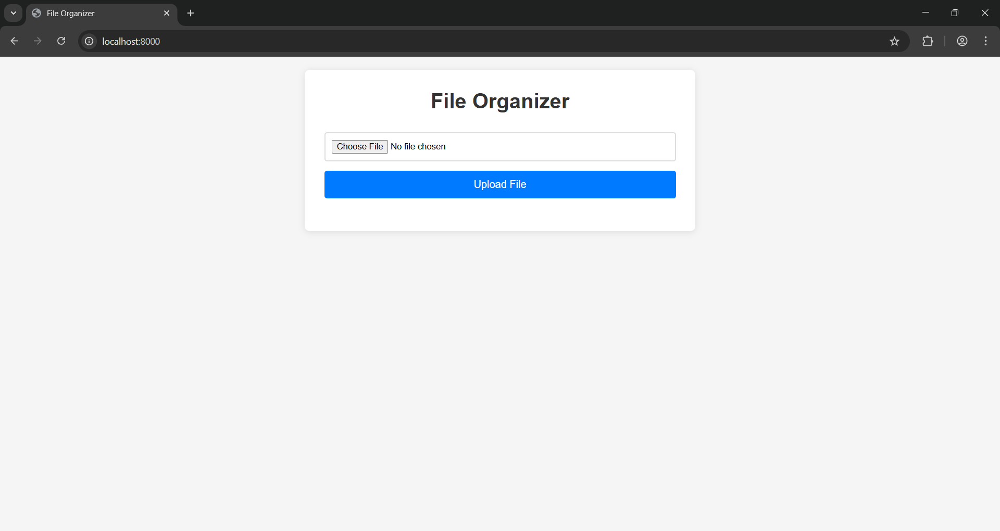
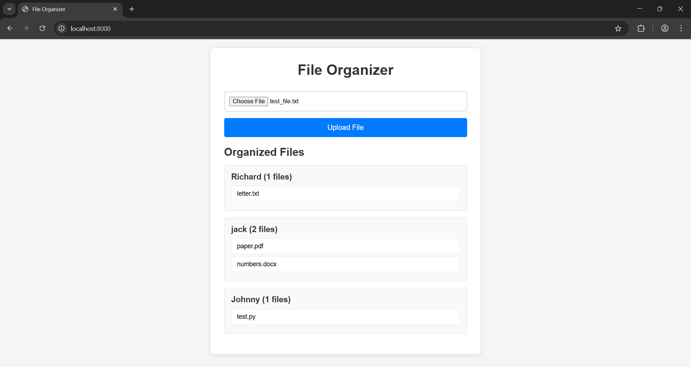
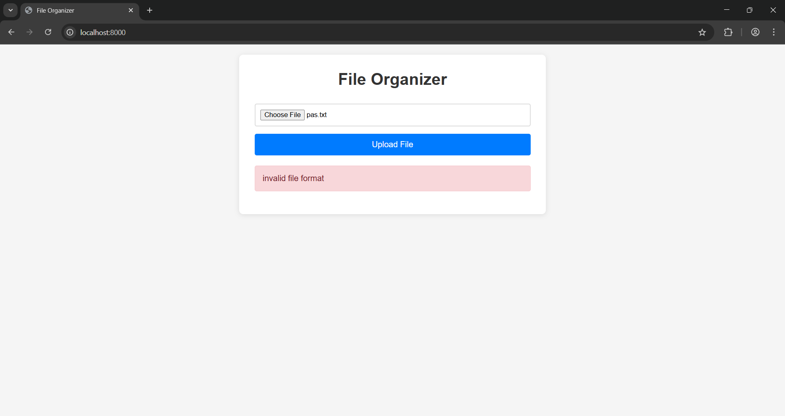

# Files Organizer

Files Organizer is a simple Laravel 12 application that organizes employee files. It accepts JSON data or a text file containing JSON, processes the file assignments, and groups them by employee.

## Requirements

-   PHP 8.2+
-   Composer
-   Laravel 12

## Installation

1. Clone the repository:

    ```
    git clone https://github.com/LAITH343/files-organizer.git
    cd files-organizer
    ```

2. Install dependencies:

    ```
    composer install
    ```

3. Copy the example environment file and configure it:

    ```
    cp .env.example .env
    ```

4. Generate application key:

    ```
    php artisan key:generate
    ```

5. Serve the application locally:

    ```
    php artisan serve
    ```

The application will be available at `http://localhost:8000`

## API Endpoints

-   `POST /api/v1/organize` - Accepts raw JSON in the request body.
-   `POST /api/v1/organize-file` - Accepts a `.txt` file containing JSON via form-data upload.

Both endpoints return organized file data grouped by employee name.

Postman collection [here](/files_organizer_collection.json)

## Screenshots

<p>
  
</p>
<p>
  
</p>
<p>
  
</p>
